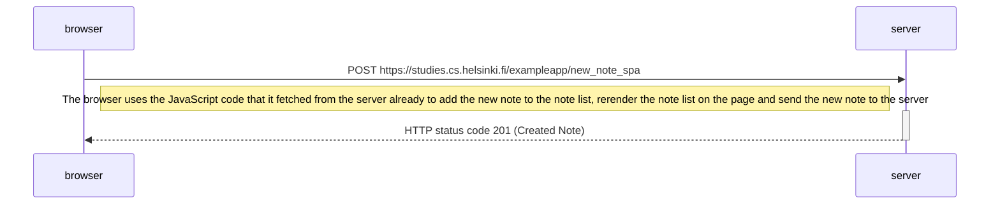

```mermaid
sequenceDiagram
    participant browser
    participant server

    browser->>server: POST https://studies.cs.helsinki.fi/exampleapp/new_note_spa
     Note right of browser: The browser uses the JavaScript code that it fetched from the server already to add the new note to the note list, rerender the note list on the page and send the new note to the server
    activate server
    server-->>browser: HTTP status code 201 (Created Note)
    deactivate server
```